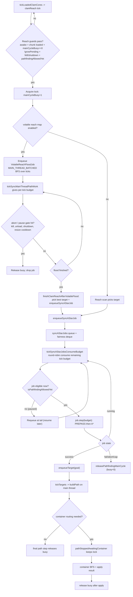

# Pathfinding and reach

## `clamReach` (`CommandToolbox`)

**When:** Called on a phased interval (**`VoidClamConfig#seekAttemptIntervalTicks`**, default 20 ticks) for each awake clam whose center chunk is loaded in that clam’s **dimension**, from **`VoidClamMod.tickLoadedClamCores`**, and from `/voidclam reach`.

**Guards:** Clam non-null, awake (`status == 1`), center chunk loaded, same `ServerWorld` as clam dimension, **`mainCycleBusy == 0`**, **not** **`VoidClamMod.isGrowRepairPendingForClam`**, kill barrier / shutdown / path resume time OK.

## Volatile reachability map (`clam_reachability_volatile_map`)

When **`true`** in `voidclam.json`, **`CommandToolbox.clamReach`** builds a **full** 6-neighbor BFS from the heart (same axis bounds as A*), using **`isPassibleForAStarStep`** without the goal exception on interior cells, and records **`BlockState`** + hop distance per visited cell in **`ReachabilityVolatileMap`**. Targets (lights/ores) are ranked by **minimum BFS distance to an adjacent step onto the goal**, then Euclidean. The same map is passed into **`Pathfinder.calculatePath`**, which wraps **`PathfindChunkCache`** so A* reads the **frozen** state for cells in the flood (others still use chunk snapshot / live world). Goal-directed prepass is **skipped** when this prebuilt map is supplied. Default **`false`** (cost tradeoff).

**Flow:**

1. Set `mainCycleBusy = 1`.
2. On executor thread: scan a box around the clam from `y - 4*cSize` to `y + 4*cSize` and horizontal `±4*cSize` for each axis.
3. Track closest **light** (if `seekLights`) and closest **ore** (if `seekOres`), excluding blacklisted positions.
4. **Tie-break:** If both exist, choose the one with **smaller squared distance**; if equal distance, **light wins** (`closestLightDist <= closestOreDist`).
5. Chosen target is added to the appropriate blacklist **before** pathfinding (so retries skip it until removed).
6. If a target exists: `Pathfinder.calculatePath(world, clamId, ...)`. If not: clear `mainCycleBusy`.

## `calculatePath` (`Pathfinder`)

- **Reachability pre-pass:** Before A\*, a 6-neighbor **BFS** from the start cell checks whether the goal is reachable under the **same search bounds** and the **same “wall vs passable” rule as A\***: an edge is allowed iff `aStarNeighborCost` for that step would be **strictly below** the wall sentinel (`2500`), including the **goal exception** for block entities (e.g. beacons). The BFS does **not** sum movement costs—only binary connectivity. If there is no such path, `mainCycleBusy` is cleared and A\* is skipped (avoids exhausting the open set for caged targets).
- **Performance note:** Today `calculatePath` is invoked from the pathfinder **worker** thread (`CommandToolbox.submitPathfinding`), same as A\*. If this pre-pass is ever called from the **server main thread** and proves too expensive for TPS, run it on worker threads the same way as A\*.
- A\* on the 6-neighbor grid with custom edge costs (wart cheap, tile entities / very hard blocks cost `2500`, air/water over solid cheap, etc.). **Heuristic:** Manhattan distance to goal (`manhattanH`). **`g`** is cumulative edge cost with re-open when a cheaper path to a cell is found.
- Search is bounded roughly by **±4×currentSize** on X/Z and **±5×currentSize** on Y from clam center (per-neighbor checks before enqueue).
- **Success:** Enqueue goal `Node` on `targets`; leave busy flag for `buildPath` to clear.
- **Failure:** Set `mainCycleBusy = 0`.

### Sync mode (`astar_mode = sync_batched`): reach pipeline with batching + pause/resume

**Reading the diagram:**

- **Batching:** Both volatile reach flood and sync A* run in **small per-tick batches** under `tickSyncMainThreadPathWork`, bounded by sync budget knobs (`astar_sync_global_max_steps_per_tick`, per-job expansion cap).
- **Pause:** A job can be skipped (not advanced) when `isPathfindingAllowedYet` is false (notably resize/path cooldown), and is rotated to the fairness tail instead of burning the whole tick budget.
- **Resume:** Once eligible again, the same queued job keeps stepping from stored phase/frontier state (`PREPASS` -> `ASTAR`) until success/failure.
- **Lock lifetime:** `mainCycleBusy` spans the whole reach->path->apply pipeline. In container-routing cases, `pathStoppedAwaitingContainer` prevents early unlock from earlier scheduled path pulses.

## `buildPath` (`Pathfinder`)

Runs on **main thread** from `tickTargets`.

**Early exits** (clear `mainCycleBusy`):

- Goal node cost `f >= 2500`
- Clam center chunk unloaded
- Goal block is ore but `!seekOres`, or light but `!seekLights` (stale enqueue after seek toggles / grow pending)

**Stamina:** `stamina[0]` starts at the clam’s `currentSize`. Each scheduled step subtracts a **cost** derived from block hardness (except goal step forced to 0). If stamina would go negative:

- Set `blocked`; if the block was not air/water/lava, **blacklist the goal** for both lights and ores and **`addEnergy(clamId, -1)`**.

**Path stop (`pathStopped`):** If the step would replace a non-goal block that has a non-air item drop, the path **stops** (no energy change for that case): schedule off-thread container BFS + main-thread apply (see below); busy flag clears after apply.

**Ore goal:** Fortune-3 style drops from `getFortune3Drops`, off-thread container BFS, then replace or barrel; busy clears after apply (or immediately if no fortune drops).

**Light goal:** Replacing the light with wart grants energy via **`addEnergy(clamId, lightEnergyForBlock)`**; soul-fire family blocks also **`addSoul(…, 1)`** (see [[Resources-and-caps]]). Clear busy flag on that final scheduled step.

**Blacklist cleanup:** Schedules `removeLightsBlackList` / `removeOresBlackList` for the goal position after a delay derived from path length (`timer`).

**Scheduling:** Walks from goal toward start; each step schedules a `VoidClamMod.scheduleDelayed` at `timer`, `timer-2`, … so pulses fire in order along the path.

## Container routing (off-thread BFS + main-thread apply)

**Intended behavior:** Storage routing is anchored to the **clam center** (core coordinates), not the block being broken. There is **no in-memory snapshot**: `Pathfinder.runContainerBfsOnWorld` runs on **`CommandToolbox.pathfinderExecutor`**, reading the **live `ServerWorld`** with the same rules as before (expand once from the center cell; continue only through nether wart; same AABB as `calculatePath`: ±4×`currentSize` on X, ±5×`currentSize` on Y and Z). It returns container positions in **BFS order from the clam center**. The main thread applies via `world.getServer().execute` → `tryInsertInto` / barrel / wart.

**Pause / lock:** When a step needs container routing, **`mainCycleBusy` stays non-zero** until the executor finishes BFS **and** the main thread has run `applyContainerResult`. That blocks **`clamReach`** (and thus new targets) for that clam. For **path-stopped** breaks (non-goal block with an item), earlier scheduled path steps along the same path would otherwise still run and clear the busy flag early; those steps **no-op** while waiting for the container apply (`pathStoppedAwaitingContainer`).

So “nearer” means **fewer graph steps from the clam center through wart (and the root cell’s neighbors)**, not Euclidean distance from the break position. A chest sitting on wart closer to the center than another chest should appear **earlier** in the list unless it is never reached (see below).

**Situations where pre-placed “near” storage might be skipped or not receive items:**

1. **Outside pathfinding range** — Storage beyond the `calculatePath` box (same limits as above) is never visited by the BFS, even if connected by wart outside that box.
2. **No path inside the box** — Traversal continues only through nether wart and the root cell. A chest that is not adjacent to wart reachable from the center inside the box does not appear in the list.
3. **Block not treated as storage** — Only `CHEST`, `TRAPPED_CHEST`, and `BARREL` are containers. Other inventories (e.g. shulker, hopper, decorated pot) are not candidates.
4. **Insert failure** — `tryInsertInto` uses `Inventory` on the block entity; if the entity is missing or the inventory is not usable as expected, that position effectively does nothing and the stack may fall through to a barrel at the break position.
5. **Concurrent breaks** — Each break schedules BFS from world state at that moment; ordering can differ under rapid changes, but should not systematically ignore center-near chests unless one of the above applies.

## Related notes

- [[Seek-caches-and-block-deltas]] — how reach scans use caches when enabled.
- [[Threading-queues-locks]]
- [[Grow-repair-and-energy]]
- [[Technical-documentation]]
